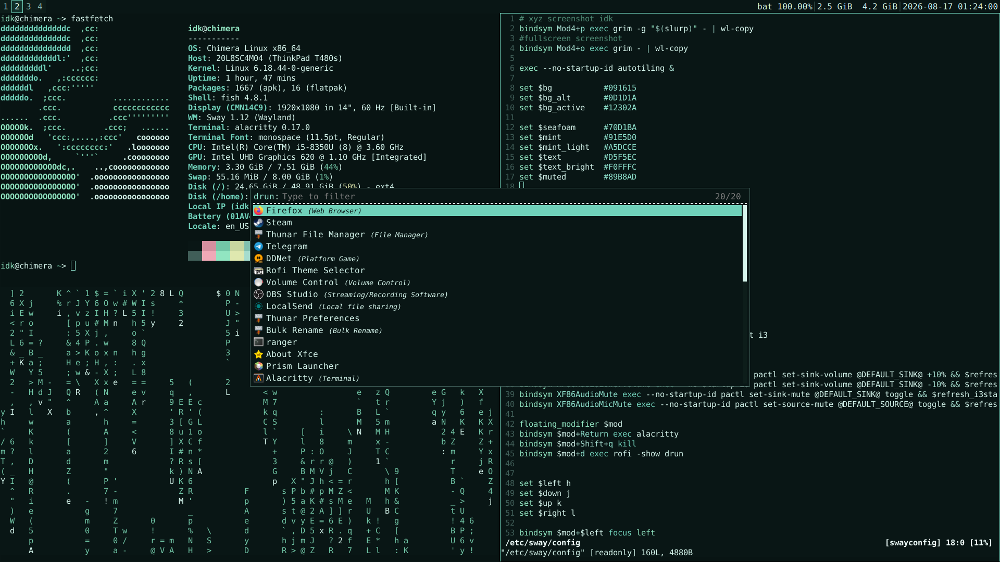

# kek its my dots btw larp larp sahur

<p align="center">
  
</p>

## put thisss shi here

* **alacritty.toml** — `~/.config/alacritty/alacritty.toml`
* **config.jsonc** — `~/.config/fastfetch/config.jsonc`
* **config.rasi** — `~/.config/rofi/config.rasi`
* **config** — `/etc/sway/config`
* **i3status.conf** — `/etc/i3status.conf`

## copy my shi wher you ned

```bash
# lmao
mkdir -p ~/.config/alacritty ~/.config/fastfetch ~/.config/rofi

 cp alacritty.toml ~/.config/alacritty/alacritty.toml
 cp config.jsonc ~/.config/fastfetch/config.jsonc
 cp config.rasi ~/.config/rofi/config.rasi

doas cp config /etc/sway/config
doas cp i3status.conf /etc/i3status.conf
```
